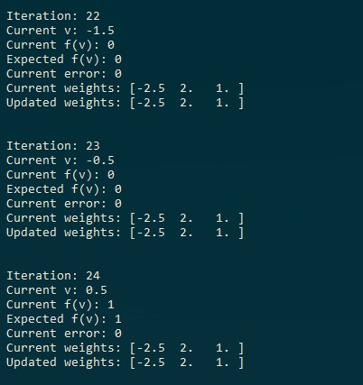
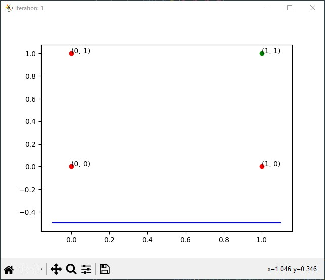
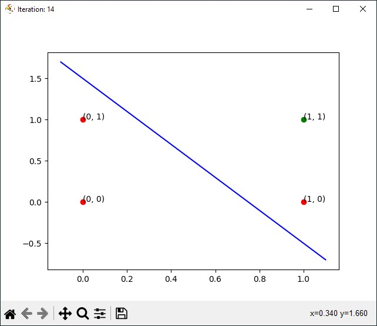
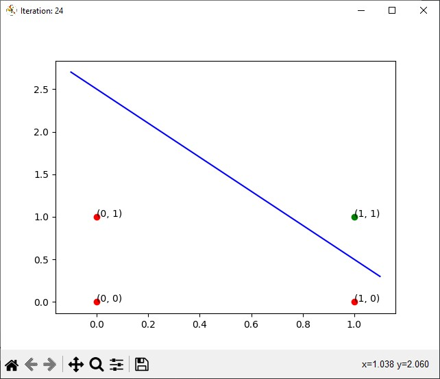
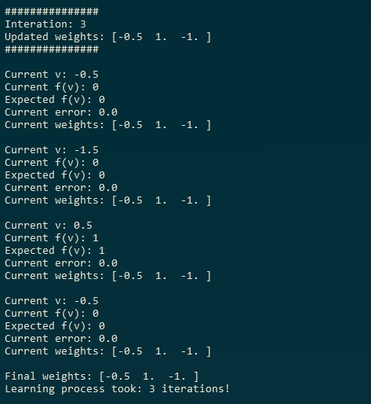
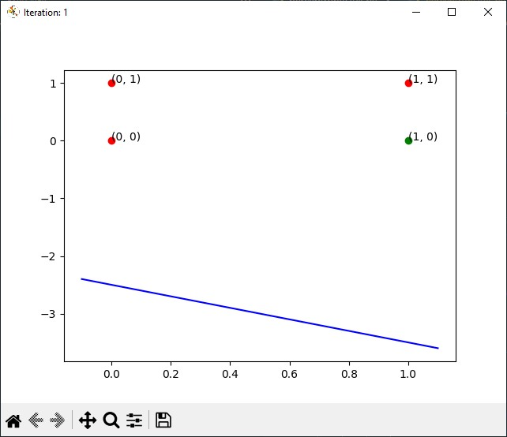
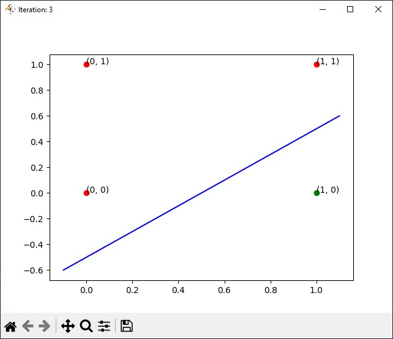
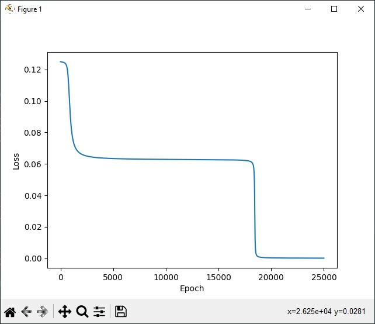
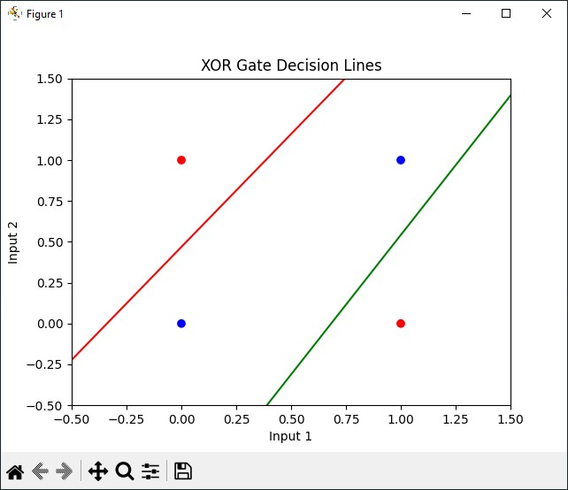
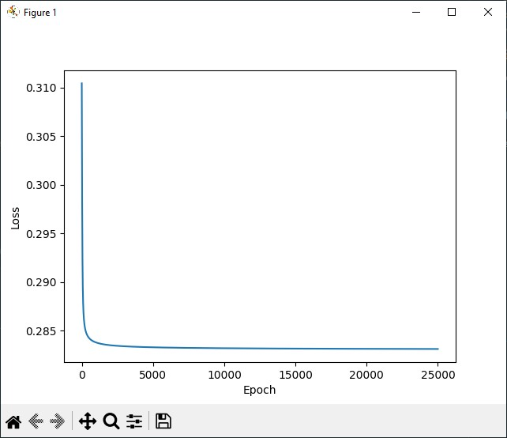

# Perceptron

Najprostszy i najbardziej podstawowy, pojedyńczy matematyczny model sztucznego neuronu. Neuron rozumiemy jako podstawowa jednosta systemu nerwowego, np. człowieka. Jest on używany do klasyfikacji binarnej.
Perceptron składa się z:

- wejścia
- wag
- stałej uczenia
- funkcji aktywacji
- wyjścia

Celem klasyfikacji używając perceptronu, jest znalezienie takich wag, aby wartości wyjściowe były odpowiednio takie same jak wartości oczekiwane.

### PA

PA - Perceptron Algorithm, podstawowy algorytm perceptronu.

### BUPA

BUPA - Batch Update Perceptron Algorithm, grupowo odświeżany algorytm perceptronu.

### Problem xor

W porównaniu do funkcji AND, której elementy są liniowo separowalne, z funkcją xor jest większy problem, ponieważ nie jest on liniowo separowalny. W związku z tym, podstawowe obliczenia perceptronu nie są wystarczające do rozwiązania tego problemu.

Przykładowym rozwiązaniem tego problemu jest na przykład podniesienie zbióru o jeden wymiar wyżej, z zastosowaniem kernelu RBF (radialna funkcja bazowej RBF).

## Opis fragmentu kodów

#### Wektory wejściowe i wagi

```python
    x1 = [1, 0, 0]
    x2 = [1, 0, 1]
    x3 = [1, 1, 0]
    x4 = [1, 1, 1]
    x = [x1, x2, x3, x4]
   
    # wagi
    w0 = [0.5, 0, 1]
```

#### Perceptron PA

```python
class PerceptronPA:
    def __init__(self, x: list[list[float]], w0: list[float], perceptron_func, ro: int = 1):
        self.x = x
        self.initial_weights = w0
        self.ro = ro
        self.y = [0, 0, 0, 0]
        self.perceptron_func = perceptron_func
       
        self.d = [0, 0, 0, 0]
        for i in range(len(x)):
            for j in range(len(x[i])):
                self.d[i] = perceptron_func(x[i])

    @classmethod
    def activation_function(cls, x):
        return 1 if x > 0 else 0

    def train(self):
        iteration = 1
        curr_weights = self.initial_weights
        curr_errors = np.ones(len(self.x))

        while self.is_not_solution(curr_errors):
            curr_errors = np.zeros(len(self.x))
            for i in range(len(self.x)):
                v = self.calc_v(x[i], curr_weights)
                y = self.activation_function(v)
                error = self.d[i] - y
                curr_errors[i] = error

                print(f"Iteration: {iteration}")
                print(f"Current v: {v}")
                print(f"Current f(v): {y}")
                print(f"Expected f(v): {self.d[i]}")
                print(f"Current error: {error}")
                print(f"Current weights: {curr_weights}")

                plot_perceptron_step(self.x, curr_weights, self.perceptron_func, f"Iteration: {iteration}")
                curr_weights = self.update_weights(curr_weights, error, x[i])
               
                print(f"Updated weights: {curr_weights}")
                iteration += 1
                print(f"\n")

    def update_weights(self, curr_weights, error, x):
        updated_weights = np.copy(curr_weights)
        for i in range(len(updated_weights)):
            updated_weights[i] += self.ro * error * x[i]
        return updated_weights

    def is_not_solution(self, errors):
        for error in errors:
            if error != 0:
                return True
        return False

    def calc_v(self, x, w) -> float:
        sum = 0
        for i in range(len(x)):
            sum += x[i] * w[i]
        return sum
```

#### Perceptron BUPA

```python
class PerceptronBUPA:
    def __init__(self, x: list[list[float]], w0: list[float], perceptron_func, ro: int = 1):
        self.x = x
        self.initial_weights = w0
        self.ro = ro
        self.y = [0, 0, 0, 0]
        self.perceptron_func = perceptron_func

        self.d = [0, 0, 0, 0]
        for i in range(len(x)):
            for j in range(len(x[i])):
                self.d[i] = perceptron_func(x[i])

    @classmethod
    def activation_function(cls, x):
        return 1 if x > 0 else 0

    def train(self):
        iteration = 1
        curr_weights = self.initial_weights

        while True:
            weight_sums = np.zeros(len(self.x[0]))
            curr_errors = np.zeros(len(self.x))
            for i in range(len(self.x)):
                v = self.calc_v(x[i], curr_weights)
                y = self.activation_function(v)
                error = self.d[i] - y
                curr_errors[i] = error

                print(f"Current v: {v}")
                print(f"Current f(v): {int(y)}")
                print(f"Expected f(v): {int(self.d[i])}")
                print(f"Current error: {error}")
                print(f"Current weights: {curr_weights}")

                self.update_weight_sums(weight_sums, error, x[i])
                print(f"")

            if self.is_not_solution(curr_errors):
                curr_weights = self.update_weights(curr_weights, weight_sums)
                print(f"###############")
                print(f"Interation: {iteration}")
                print(f"Updated weights: {curr_weights}")
                print(f"###############\n")
               
                plot_perceptron_step(self.x, curr_weights, self.perceptron_func, f"Iteration: {iteration}")
                iteration += 1
            else:
                print(f"Final weights: {curr_weights}")
                print(f"Learning process took: {iteration-1} iterations!")
                break

    def update_weight_sums(self, weight_sums, error, x):
        for i in range(len(weight_sums)):
            weight_sums[i] += error * x[i]

    def update_weights(self, curr_weights, weight_sums):
        updated_weights = np.copy(curr_weights)
        for i in range(len(updated_weights)):
            updated_weights[i] += self.ro * weight_sums[i]
        return updated_weights

    def is_not_solution(self, errors):
        for error in errors:
            if error != 0:
                return True
        return False

    def calc_v(self, x, w) -> float:
        sum = 0
        for i in range(len(x)):
            sum += x[i] * w[i]
        return sum
```

#### Pomocnicze funkcje, w tym do rysowania wykresów

```python
def perceptron_and(x: list[float]) -> float:
    return x[1] and x[2]

def perceptron_and_x2_negation(x: list[float]) -> float:
    return float(x[1] and not x[2])

def calc_linear_func(x, w: list[float]):
    xf = []
    for xi in x:
        y = -(w[0] / w[2]) - ((xi * w[1]) / w[2])
        xf.append(y)
    return xf

def plot_linear_function(w):
    x = np.linspace(-0.1, 1.1, 1000)
    f = calc_linear_func(x, w)
    plt.plot(x, f, '-', color="blue")

def plot_point(x: list[float], perceptron_func):
    color = "green"
    if perceptron_func(x) == 0:
        color = "red"
    plt.plot(x[1], x[2], 'o', color=color)
    plt.text(x[1], x[2], "(" + str(x[1]) + ", " + str(x[2]) + ")")

def plot_perceptron_step(x: list[list[float]], w, perceptron_func, label: str = ""):
    if label == "":
        plt.figure()
    else:
        plt.figure(label)

    for xi in x:
        plot_point(xi, perceptron_func)
    plot_linear_function(w)
```

### Przykładowo wygenerowane wykresy

#### PA






#### BUPA





# Sieć Hopfielda

Sieć neuronowa, która tak samo jak perceptron posiada neurony oraz ich połączenia.

### Tryb synchroniczny

### Tryb asynchroniczny

## Opis fragmentów kodu

### Przykładowo wygenerowane wykresy

# Algorytm Propagacji Wstecznej

Posiadając dużą sieć neuronową z wieloma warstwami, używając algorytmu propagacji wstecznej jesteśmy w stanie modyfikować wagi we wszystkich jej warstwach. Korzystając z tego algorytmu cofamy się do tyłu, warstwa po warstwie, tak jak to nazwa wskazuje, dochodząc do wybranej przez nas warstwy, aby zmienić jej wagę.

### Energia całkowita

Korzystając z energii całkowitej, wagi są aktualizowane po prezentacji wszystkich wektorów wejściowych.

### Energia cząstkowa

W przypadku korzystania z energii cząstkowej, wagi są aktualizowane po każdym pojedynczym prezentowanym wektorze wejściowym.

## Opis fragmentów kodu

Wektory wejściowe, wektor dla funkcji xor

```python
X1 = np.array([[1, 0, 0], [1, 0, 1], [1, 1, 0], [1, 1, 1]])
Y = np.array([[0], [1], [1], [0]])
```

Wagi wejściowe, zgodne z poleceniem

```python
def initial_weights():
    W2 = np.array([
        [0.86, 0.82],
        [-0.16, -0.51],
        [0.28, -0.89]
    ])
    W3 = np.array([
        [0.04],
        [-0.43],
        [0.48]
    ])
    return W2, W3
```

Funkcja wyliczająca xor z macierzy wektorów wejściowych i wag

```python
def calculate_xor():
    x1 = np.array([[0, 0], [0, 1], [1, 0], [1, 1]])
    x1 = np.hstack((np.ones((4, 1)), x1))
    x2 = sigmoid(np.dot(x1, W2))
    x2 = np.hstack((np.ones((4, 1)), x2))
    x3 = sigmoid(np.dot(x2, W3))
   
    print("XOR Input:")
    print(x1)
    print("XOR Output:")
    print(x3.round())
```

Funkcje do rysowania wykresów

```python
def plot_loss_graph():
    plt.plot(range(epochs), loss_values)
    plt.xlabel('Epoch')
    plt.ylabel('Loss')
    plt.show()

def plot_decision_boundary():
    x = np.linspace(-0.5, 1.5, 100)
    y1 = (-W2[0, 0] - W2[1, 0] * x) / W2[2, 0]
    y2 = (-W2[0, 1] - W2[1, 1] * x) / W2[2, 1]

    plt.scatter(X1[:, 1], X1[:, 2], c=Y.ravel(), cmap='bwr')
    plt.plot(x, y1, 'g-', label='Decision Line 1')
    plt.plot(x, y2, 'r-', label='Decision Line 2')
    plt.title('XOR Gate Decision Lines')
    plt.xlabel('Input 1')
    plt.ylabel('Input 2')
    plt.xlim(-0.5, 1.5)
    plt.ylim(-0.5, 1.5)
    plt.show()
```

Wsteczna propagacja z uwzględnieniem energii całkowitej

```python
#################
# total energy
#################

W2, W3 = initial_weights()

for epoch in range(epochs):
    # forward propagation
    X2 = sigmoid(np.dot(X1, W2))
    X2 = np.hstack((np.ones((4, 1)), X2))  #add dummy input
    X3 = sigmoid(np.dot(X2, W3))
   
    # loss
    loss = np.mean(0.5 * (Y - X3) ** 2)
    loss_values.append(loss)

    # backward propagation
    delta3 = (Y - X3) * sigmoid_derivative(X3)
    delta2 = delta3.dot(W3.T) * sigmoid_derivative(X2)

    # weights
    W3 += X2.T.dot(delta3) * learning_rate
    W2 += (X1.T.dot(delta2))[:, 1:] * learning_rate

calculate_xor()
plot_loss_graph()
plot_decision_boundary()
```

Wsteczna propagacja z uwzględnieniem energii cząstkowej

```python
#################
# batch energy
#################

W2, W3 = initial_weights()

loss_values = []

for epoch in range(epochs):
    loss = 0.

    for i in range(len(X1)):
        # forward propagation
        X2 = sigmoid(np.dot(X1, W2))
        X2 = np.hstack((np.ones((4, 1)), X2))  #add dummy input
        X3 = sigmoid(np.dot(X2, W3))

        # loss
        loss += (Y[i] - X3[i]) ** 2

        # backward propagation
        delta3 = (Y[i] - X3[i]) * sigmoid_derivative(X3)
        delta2 = delta3.dot(W3.T) * sigmoid_derivative(X2)

        # weights
        W3 += X2.T.dot(delta3) * learning_rate
        W2 += (X1.T.dot(delta2))[:, 1:] * learning_rate

    loss_values.append(loss / len(X1))

calculate_xor()
plot_loss_graph()
plot_decision_boundary()
```

### Przykładowo wygenerowane wykresy

#### Dla energii całkowitej




#### Dla energii cząstkowej


