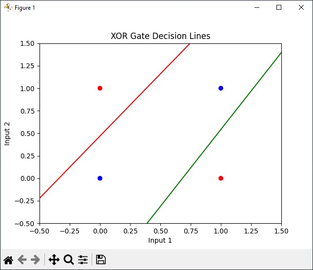

# Perceptron

Najprostszy i najbardziej podstawowy, pojedyńczy matematyczny model sztucznego neuronu. Neuron rozumiemy jako podstawowa jednosta systemu nerwowego, np. człowieka. Jest on używany do klasyfikacji binarnej.
Perceptron składa się z:
- wejścia
- wag
- stałej uczenia
- funkcji aktywacji
- wyjścia

Celem klasyfikacji używając perceptronu, jest znalezienie takich wag, aby wartości wyjściowe były odpowiednio takie same jak wartości oczekiwane.


### PA
PA - Perceptron Algorithm, podstawowy algorytm perceptronu.

### BUPA
BUPA - Batch Update Perceptron Algorithm, grupowo odświeżany algorytm perceptronu.

### Problem xor
W porównaniu do funkcji AND, której elementy są liniowo separowalne, z funkcją xor jest większy problem, ponieważ nie jest on liniowo separowalny. W związku z tym, podstawowe obliczenia perceptronu nie są wystarczające do rozwiązania tego problemu. 

Przykładowym rozwiązaniem tego problemu jest na przykład podniesienie zbióru o jeden wymiar wyżej, z zastosowaniem kernelu RBF (radialna funkcja bazowej RBF).

## Opis fragmentu kodów

### Przykładowo wygenerowane wykresy

# Sieć Hopfielda
Sieć neuronowa, która tak samo jak perceptron posiada neurony oraz ich połączenia.

### Tryb synchroniczny

### Tryb asynchroniczny

## Opis fragmentów kodu

### Przykładowo wygenerowane wykresy

# Algorytm Propagacji Wstecznej

Posiadając dużą sieć neuronową z wieloma warstwami, używając algorytmu propagacji wstecznej jesteśmy w stanie modyfikować wagi we wszystkich jej warstwach. Korzystając z tego algorytmu cofamy się do tyłu, warstwa po warstwie, tak jak to nazwa wskazuje, dochodząc do wybranej przez nas warstwy, aby zmienić jej wagę.

### Energia całkowita
Korzystając z energii całkowitej, wagi są aktualizowane po prezentacji wszystkich wektorów wejściowych.

### Energia cząstkowa
W przypadku korzystania z energii cząstkowej, wagi są aktualizowane po każdym pojedynczym prezentowanym wektorze wejściowym.

## Opis fragmentów kodu

Wektory wejściowe, wektor dla funkcji xor
``` python
X1 = np.array([[1, 0, 0], [1, 0, 1], [1, 1, 0], [1, 1, 1]])
Y = np.array([[0], [1], [1], [0]])
```

Wagi wejściowe, zgodne z poleceniem
``` python
def initial_weights():
    W2 = np.array([
        [0.86, 0.82],
        [-0.16, -0.51],
        [0.28, -0.89]
    ])
    W3 = np.array([
        [0.04],
        [-0.43],
        [0.48]
    ])
    return W2, W3
```

Funkcja wyliczająca xor z macierzy wektorów wejściowych i wag
```python
def calculate_xor():
    x1 = np.array([[0, 0], [0, 1], [1, 0], [1, 1]])
    x1 = np.hstack((np.ones((4, 1)), x1))
    x2 = sigmoid(np.dot(x1, W2))
    x2 = np.hstack((np.ones((4, 1)), x2))
    x3 = sigmoid(np.dot(x2, W3))
    
    print("XOR Input:")
    print(x1)
    print("XOR Output:")
    print(x3.round())
```

Funkcje do rysowania wykresów
```python
def plot_loss_graph():
    plt.plot(range(epochs), loss_values)
    plt.xlabel('Epoch')
    plt.ylabel('Loss')
    plt.show()
  
def plot_decision_boundary():
    x = np.linspace(-0.5, 1.5, 100)
    y1 = (-W2[0, 0] - W2[1, 0] * x) / W2[2, 0]
    y2 = (-W2[0, 1] - W2[1, 1] * x) / W2[2, 1]

    plt.scatter(X1[:, 1], X1[:, 2], c=Y.ravel(), cmap='bwr')
    plt.plot(x, y1, 'g-', label='Decision Line 1')
    plt.plot(x, y2, 'r-', label='Decision Line 2')
    plt.title('XOR Gate Decision Lines')
    plt.xlabel('Input 1')
    plt.ylabel('Input 2')
    plt.xlim(-0.5, 1.5)
    plt.ylim(-0.5, 1.5)
    plt.show()
```


Wsteczna propagacja z uwzględnieniem energii całkowitej
```python
#################
# total energy
#################

W2, W3 = initial_weights()

for epoch in range(epochs):
    # forward propagation
    X2 = sigmoid(np.dot(X1, W2))
    X2 = np.hstack((np.ones((4, 1)), X2))  #add dummy input
    X3 = sigmoid(np.dot(X2, W3))
    
    # loss
    loss = np.mean(0.5 * (Y - X3) ** 2)
    loss_values.append(loss)
  
    # backward propagation
    delta3 = (Y - X3) * sigmoid_derivative(X3)
    delta2 = delta3.dot(W3.T) * sigmoid_derivative(X2)

    # weights
    W3 += X2.T.dot(delta3) * learning_rate
    W2 += (X1.T.dot(delta2))[:, 1:] * learning_rate
  
calculate_xor()
plot_loss_graph()
plot_decision_boundary()
```

Wsteczna propagacja z uwzględnieniem energii cząstkowej
```python
#################
# batch energy
#################
  
W2, W3 = initial_weights()

loss_values = []

for epoch in range(epochs):
    loss = 0.

    for i in range(len(X1)):
        # forward propagation
        X2 = sigmoid(np.dot(X1, W2))
        X2 = np.hstack((np.ones((4, 1)), X2))  #add dummy input
        X3 = sigmoid(np.dot(X2, W3))

        # loss
        loss += (Y[i] - X3[i]) ** 2

        # backward propagation
        delta3 = (Y[i] - X3[i]) * sigmoid_derivative(X3)
        delta2 = delta3.dot(W3.T) * sigmoid_derivative(X2)

        # weights
        W3 += X2.T.dot(delta3) * learning_rate
        W2 += (X1.T.dot(delta2))[:, 1:] * learning_rate

    loss_values.append(loss / len(X1))

calculate_xor()
plot_loss_graph()
plot_decision_boundary()
```

### Przykładowo wygenerowane wykresy
#### Dla energii całkowitej



#### Dla energii cząstkowej

